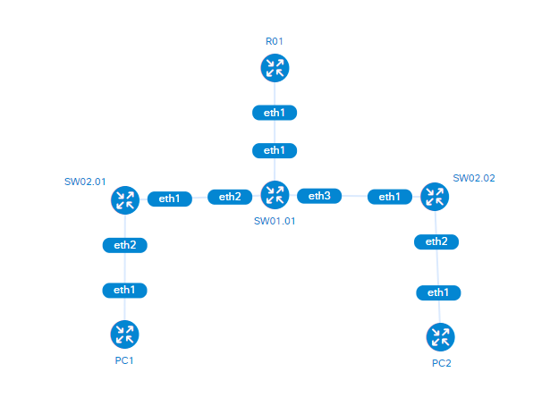
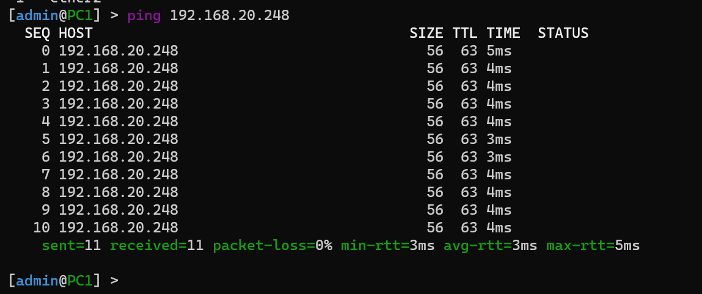

# Lab 1

University: [ITMO University](https://itmo.ru/ru/)

Faculty: [FICT](https://fict.itmo.ru/)

Course: [Introduction in routing](https://github.com/itmo-ict-faculty/introduction-in-routing)

Year: 2022/2023

Group: K33202

Author: Sorokin N. A.

Lab: Lab1

Date of create: 4.10.2022

Date of finished: 16.12.2022

---

# Топология

Топология использованная для реализации лабораторной работы представлена в файле topology.yml, а так же на схеме ниже.



Граф топологии

---

# Запуск контейнеров

Разворачивание лабораторной работы производится с помощью команды `clab deploy —topo topology.yml`

Для перезапуска лабораторной работы со сбросом всех внутренних настроек используется флаг запуска `—reconfigure`

---

# Конфигурация устройств

Ниже будут перечислены конфигурации и обозначения команд для настройки сетевого оборудования.

## R01

Подключение: `ssh admin@172.20.1.2` 
Пароль: admin

### Настройка vlan

Для добавление vlan используется следующая команда с параметрами:

`interface vlan add interface=[интерфейс] name=[название] vlan-id=[id vlan’а]`

Для указывания адреса для vlan выполняем следующую команду:

`ip address add address=[Адрес интерфейса] interface=[имя интерфейса] network=[сеть для интерфейса]`

*Конфигурация vlan’ов на устройстве R01:*

```yaml
/interface vlan
add interface=ether2 name=vlan10 vlan-id=10
add interface=ether2 name=vlan20 vlan-id=20
/ip address
add address=192.168.10.1/24 interface=vlan10 network=192.168.10.0
add address=192.168.20.1/24 interface=vlan20 network=192.168.20.0
```

### Настройка DHCP

Для добавления DHCP сервера необходимо выполнить следующие пункты:

1. Добавить пул адресов
    
    `ip pool add name=[название] ranges=[область адресов формата start-stop]`
    
2. Добавить сеть для DHCP сервера
    
    `ip dhcp-server network add address=[адрес сети с маской] gateway=[шлюз по умолчанию]`
    
3. Создать DHCP сервер
    
    `ip dhcp-server add address-pool=[название пула] disabled=[параметр отключения yes
    no] interface=[название интерфейса] name=[название сервера]`
    

Таким образом будет создан и настроен DHCP сервер на главном роутере и будет закончена его полная настройка

### Полная конфигурация

```python
/interface vlan
add interface=ether2 name=vlan10 vlan-id=10
add interface=ether2 name=vlan20 vlan-id=20
/interface wireless security-profiles
set [ find default=yes ] supplicant-identity=MikroTik
/ip pool
add name=pool1 ranges=192.168.10.10-192.168.10.250
add name=pool2 ranges=192.168.20.10-192.168.20.250
/ip dhcp-server
add address-pool=pool1 disabled=no interface=vlan10 name=server1
add address-pool=pool2 disabled=no interface=vlan20 name=server2
/ip address
add address=172.31.255.30/30 interface=ether1 network=172.31.255.28
add address=192.168.10.1/24 interface=vlan10 network=192.168.10.0
add address=192.168.20.1/24 interface=vlan20 network=192.168.20.0
/ip dhcp-client
add disabled=no interface=ether1
/ip dhcp-server network
add address=192.168.10.0/24 gateway=192.168.10.1
add address=192.168.20.0/24 gateway=192.168.20.1
/system identity
set name=R01
```

---

## SW01.01

Подключение: `ssh admin@172.20.1.3`
Пароль: admin

Для настройки центрального коммутатора требуется создать два vlan’а и  разделить их на два физических интерфейса с помощью bridge по следующей схеме:

- ether2 → vlan10 → bridge10 → vlan100 → ether3
- ether2 → vlan20 → bridge20 → vlan200 → ether4

### Настройка bridge

Для создания виртуального неуправляемого коммутатора (bridge) используем команду:

`interface bridge add name=[имя bridge]`

Связывание bridge с определенным интерфейсом:

`interface bridge port add bridge=[имя bridge] interface=[интерфейс]`

*Конфигурация bridge на SW01.01:*

```yaml
/interface bridge
add name=bridge10
add name=bridge20
/interface vlan
add interface=ether2 name=vlan10 vlan-id=10
add interface=ether2 name=vlan20 vlan-id=20
add interface=ether3 name=vlan100 vlan-id=10
add interface=ether4 name=vlan200 vlan-id=20
/interface bridge port
add bridge=bridge20 interface=vlan20
add bridge=bridge20 interface=vlan200
add bridge=bridge10 interface=vlan10
add bridge=bridge10 interface=vlan100
```

### Настройка DHCP

Для получения адресов уже настроенных bridge’й привяжем к ним DHCP клиента:

`ip dhcp-client add disabled=[yes|no] interface=[интерфейс]`

### Промежуточная проверка

Для того, чтобы убедиться, что каждый dhcp-client получил адреса из соответствующих пулов, используем команду `ip dhcp-client print` , где мы сможем увидеть что адреса получены успешно

### Полная конфигурация

```python
/interface bridge
add name=bridge10
add name=bridge20
/interface vlan
add interface=ether2 name=vlan10 vlan-id=10
add interface=ether2 name=vlan20 vlan-id=20
add interface=ether3 name=vlan100 vlan-id=10
add interface=ether4 name=vlan200 vlan-id=20
/interface wireless security-profiles
set [ find default=yes ] supplicant-identity=MikroTik
/interface bridge port
add bridge=bridge20 interface=vlan20
add bridge=bridge20 interface=vlan200
add bridge=bridge10 interface=vlan10
add bridge=bridge10 interface=vlan100
/ip address
add address=172.31.255.30/30 interface=ether1 network=172.31.255.28
/ip dhcp-client
add disabled=no interface=ether1
add disabled=no interface=bridge20
add disabled=no interface=bridge10
/system identity
set name=SW01.01
```

---

## SW02.01

Подключение: `ssh admin@172.20.1.4`
Пароль: admin

Для настройки внешних коммутаторов требуется создать и настроить соответствующие vlan bridge и dhcp-client используя команды, представленные выше.

Мы добавляем bridge, соединяющий внешний физический интерфейс ether3 с внутренним виртуальным vlan10 для того, чтобы весь нетэгированный трафик, проходящий через ether3 в bridge получал соответствующую метку vlan10.

### Полная конфигурация устройства

```python
/interface bridge
add name=bridge10
/interface vlan
add interface=ether2 name=vlan10 vlan-id=10
/interface wireless security-profiles
set [ find default=yes ] supplicant-identity=MikroTik
/interface bridge port
add bridge=bridge10 interface=vlan10
add bridge=bridge10 interface=ether3
/ip address
add address=172.31.255.30/30 interface=ether1 network=172.31.255.28
/ip dhcp-client
add disabled=no interface=ether1
add disabled=no interface=bridge10
/system identity
set name=SW02.01
```

---

## SW02.02

Подключение: `ssh admin@172.20.1.5`
Пароль: admin

Логика настройки коммутатора SW02.02 полностью соответствует настройке SW01.01. 

### Полная конфигурация устройства

```python
/interface bridge
add name=bridge20
/interface vlan
add interface=ether2 name=vlan20 vlan-id=20
/interface wireless security-profiles
set [ find default=yes ] supplicant-identity=MikroTik
/interface bridge port
add bridge=bridge20 interface=vlan20
add bridge=bridge20 interface=ether3
/ip address
add address=172.31.255.30/30 interface=ether1 network=172.31.255.28
/ip dhcp-client
add disabled=no interface=ether1
add disabled=no interface=bridge20
/system identity
set name=SW02.02
```

---

## PC1 | PC2

Подключение: `ssh admin@172.20.1.[6|7]`

Пароль: admin

Из-за особенностей оболочки *containerlab* в качестве хостов были выбраны дополнительные маршрутизаторы Router-OS.

Для корректного подключения устройства и получения им ip-адреса по DHCP требуется добавить dhcp-client на физический порт ether2 соединяющийся с внешним коммутатором.

### Полная конфигурация PC1

```python
/interface wireless security-profiles
set [ find default=yes ] supplicant-identity=MikroTik
/ip address
add address=172.31.255.30/30 interface=ether1 network=172.31.255.28
/ip dhcp-client
add disabled=no interface=ether1
add disabled=no interface=ether2
/system identity
set name=PC1
```

### Полная конфигурация PC2

```python
/interface wireless security-profiles
set [ find default=yes ] supplicant-identity=MikroTik
/ip address
add address=172.31.255.30/30 interface=ether1 network=172.31.255.28
/ip dhcp-client
add disabled=no interface=ether1
add disabled=no interface=ether2
/system identity
set name=PC2
```

---

# Проверка сети

Для того чтобы удостовериться, что топология построена верно, и все сетевые устройства сконфигурированы корректно, попробуем сделать ping запрос от PC1, находящемся во VLAN10 к PC2 во VLAN20.

`ping 192.168.20.248`



Результат выполнения команды

В выводе команды можем заметить, что PC1 успешно производит запрос к PC2, что подтверждает правильность настройки сети.
