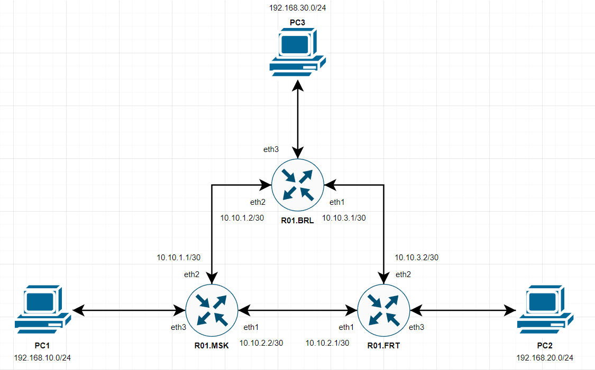
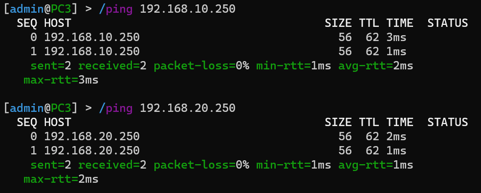
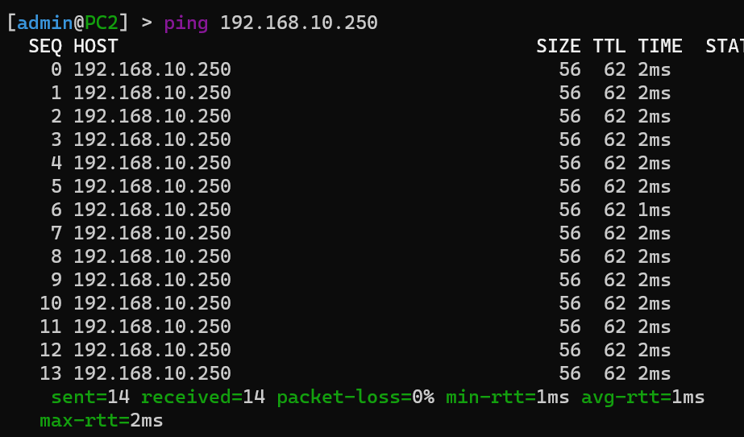

# Lab 2

University: [ITMO University](https://itmo.ru/ru/)

Faculty: [FICT](https://fict.itmo.ru/)

Course: [Introduction in routing](https://github.com/itmo-ict-faculty/introduction-in-routing)

Year: 2022/2023

Group: K33202

Author: Sorokin N. A.

Lab: Lab1

Date of create: 4.10.2022

Date of finished: 16.12.2022

---

# Топология

Топология использованная для реализации лабораторной работы представлена в файле topology.yml, а так же на схеме ниже.



---

# Запуск контейнеров

Разворачивание лабораторной работы производится с помощью команды `clab deploy —topo topology.yml`

Для перезапуска лабораторной работы со сбросом всех внутренних настроек используется флаг запуска `—reconfigure`

---

# Конфигурация устройств

Ниже будут перечислены конфигурации и обозначения команд для настройки сетевого оборудования.

## R01.MSK

Подключение: `ssh admin@172.20.2.2`

Пароль: admin

Для корректной настройки маршрутизатора R01.MSK требуется добавить:

1. Vlan
    
    Требуется создать vlan интерфейс смотрящий в сторону внешних хостов:
    
    ```yaml
    interface vlan add interface=ether4 name=vlan10 vlan-id=10
    ```
    
2. Настройка адресов интерфейсов
    
    Для последующей настройки статических маршрутов требуется указать адреса интерфейсов соответственно разработанной схеме топологии:
    
    ```yaml
    /ip address
    add address=10.10.1.1/30 interface=ether3 network=10.10.1.0
    add address=10.10.2.2/30 interface=ether2 network=10.10.2.0
    ```
    
3. DHCP server
    
    Создание DHCP сервера аналогично с предыдущей лабораторной работе, ниже указаны финальные команды
    
    ```yaml
    /ip pool
    add name=pool10 ranges=192.168.10.10-192.168.10.250
    /ip dhcp-server network
    add address=192.168.10.0/24 gateway=192.168.10.1
    /ip dhcp-server
    add address-pool=pool10 disabled=no interface=vlan10 name=server10
    ```
    
4. Статические маршруты
    
    Для того чтобы описать статические маршруты между устройствами внутри маршрутизатора, воспользуемся командами:
    
    ```yaml
    /ip route
    add distance=1 dst-address=192.168.20.0/24 gateway=10.10.2.1
    add distance=1 dst-address=192.168.30.0/24 gateway=10.10.1.2
    ```
    
    После этого маршрутизатор будет знать, как добраться до данных сетей внутри себя.
    

### Полная конфигурация

```yaml
/interface vlan
add interface=ether4 name=vlan10 vlan-id=10
/interface wireless security-profiles
set [ find default=yes ] supplicant-identity=MikroTik
/ip pool
add name=pool10 ranges=192.168.10.10-192.168.10.250
/ip dhcp-server
add address-pool=pool10 disabled=no interface=vlan10 name=server10
/ip address
add address=172.31.255.30/30 interface=ether1 network=172.31.255.28
add address=192.168.10.1/24 interface=vlan10 network=192.168.10.0
add address=10.10.1.1/30 interface=ether3 network=10.10.1.0
add address=10.10.2.2/30 interface=ether2 network=10.10.2.0
/ip dhcp-client
add disabled=no interface=ether1
/ip dhcp-server network
add address=192.168.10.0/24 gateway=192.168.10.1
/ip route
add distance=1 dst-address=192.168.20.0/24 gateway=10.10.2.1
add distance=1 dst-address=192.168.30.0/24 gateway=10.10.1.2
/system identity
set name=R01.MSK
```

---

## R01.FRT

Подключение: `ssh admin@172.20.2.3`

Пароль: admin

Логика настройки данного маршрутизатора аналогична R01.MSK и рассмотрена не будет. Все настройки на устройстве скорректированы для соответствия схеме топологии.

### Полная конфигурация

```yaml
/interface vlan
add interface=ether4 name=vlan20 vlan-id=20
/interface wireless security-profiles
set [ find default=yes ] supplicant-identity=MikroTik
/ip pool
add name=pool20 ranges=192.168.20.10-192.168.20.250
/ip dhcp-server
add address-pool=pool20 disabled=no interface=vlan20 name=server20
/ip address
add address=172.31.255.30/30 interface=ether1 network=172.31.255.28
add address=192.168.20.1/24 interface=vlan20 network=192.168.20.0
add address=10.10.2.1/30 interface=ether2 network=10.10.2.0
add address=10.10.3.2/30 interface=ether3 network=10.10.3.0
/ip dhcp-client
add disabled=no interface=ether2
add disabled=no interface=ether1
/ip dhcp-server network
add address=192.168.20.0/24 gateway=192.168.20.1
/ip route
add distance=1 dst-address=192.168.10.0/24 gateway=10.10.2.2
add distance=1 dst-address=192.168.30.0/24 gateway=10.10.3.1
/system identity
set name=R01.FRT
```

---

## R01.BRL

Подключение: `ssh admin@172.20.2.4`

Пароль: admin

Логика настройки данного маршрутизатора аналогична R01.MSK и рассмотрена не будет. Все настройки на устройстве скорректированы для соответствия схеме топологии.

### Полная конфигурация

```yaml
/interface vlan
add interface=ether4 name=vlan30 vlan-id=30
/interface wireless security-profiles
set [ find default=yes ] supplicant-identity=MikroTik
/ip pool
add name=pool30 ranges=192.168.30.10-192.168.30.250
/ip dhcp-server
add address-pool=pool30 disabled=no interface=vlan30 name=server30
/ip address
add address=172.31.255.30/30 interface=ether1 network=172.31.255.28
add address=192.168.30.1/24 interface=vlan30 network=192.168.30.0
add address=10.10.1.2/30 interface=ether3 network=10.10.1.0
add address=10.10.3.1/30 interface=ether2 network=10.10.3.0
/ip dhcp-client
add disabled=no interface=ether1
/ip dhcp-server network
add address=192.168.30.0/24 gateway=192.168.30.1
/ip route
add distance=1 dst-address=192.168.10.0/24 gateway=10.10.1.1
add distance=1 dst-address=192.168.20.0/24 gateway=10.10.3.2
/system identity
set name=R01.BRL
```

---

## PC1 | PC2 | PC3

Подключение: `ssh admin@172.20.2.[5-7]`

Пароль: admin

Аналогично предыдущей лабораторной работе, в качестве финальных хостов были использованы устройства RouteOS.

### Добавления bridge

Для того чтобы устройства не отбрасывали тегированный трафик, мы должны создать bridge и связать с ним dhcp-client для получения ip-адреса

```yaml
/interface bridge
add name=bridge
/interface bridge port
add bridge=bridge interface=vlan10
/ip dhcp-client
add disabled=no interface=bridge
```

### Задание статического маршрута

Для того чтобы хост знал адрес маршрутизатора, к которому подключен, зададим ему статический маршрут

```yaml
/ip route
add dst-address=192.168.10.1/32 gateway=192.168.10.0
```

### Полная конфигурация PC1

```python
/interface bridge
add name=bridge
/interface vlan
add interface=ether4 name=vlan10 vlan-id=10
/interface wireless security-profiles
set [ find default=yes ] supplicant-identity=MikroTik
/interface bridge port
add bridge=bridge interface=vlan10
/ip address
add address=172.31.255.30/30 interface=ether1 network=172.31.255.28
/ip dhcp-client
add disabled=no interface=ether1
add disabled=no interface=bridge
/ip route
add distance=1 dst-address=192.168.10.1/32 gateway=192.168.10.0
/system identity
set name=PC1
```

### Полная конфигурация PC2

```python
/interface bridge
add name=bridge
/interface vlan
add interface=ether4 name=vlan20 vlan-id=20
/interface wireless security-profiles
set [ find default=yes ] supplicant-identity=MikroTik
/interface bridge port
add bridge=bridge interface=vlan20
/ip address
add address=172.31.255.30/30 interface=ether1 network=172.31.255.28
/ip dhcp-client
add disabled=no interface=ether1
add disabled=no interface=bridge
/system identity
set name=PC2
```

### Полная конфигурация PC3

```python
/interface bridge
add name=bridge
/interface vlan
add interface=ether4 name=vlan30 vlan-id=30
/interface wireless security-profiles
set [ find default=yes ] supplicant-identity=MikroTik
/interface bridge port
add bridge=bridge interface=vlan30
/ip address
add address=172.31.255.30/30 interface=ether1 network=172.31.255.28
/ip dhcp-client
add disabled=no interface=ether1
add disabled=no interface=bridge
/system identity
set name=PC3
```

---

# Проверка сети

Для проверки успешной конфигурации сети проведем серию ping запросов от всех конечных хостов:

*ping от PC3*



*ping от PC2*



Таким образом, все сетевые устройства успешно могут простроить маршрут и соединиться друг с другом
