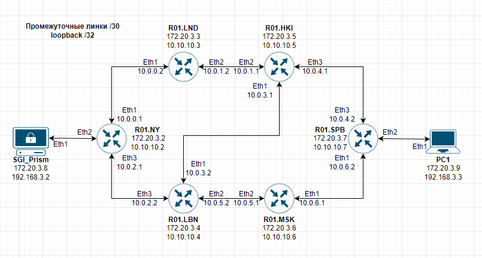
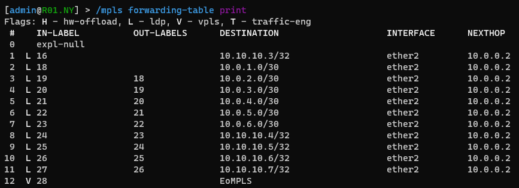
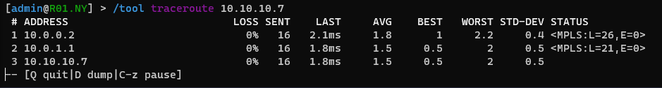
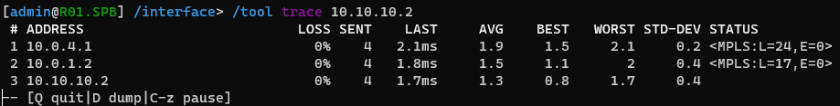
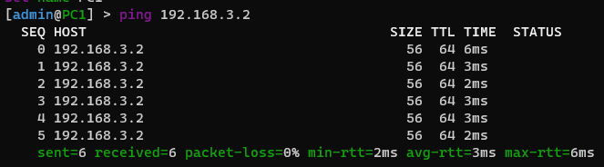

# Lab 3

University: [ITMO University](https://itmo.ru/ru/)

Faculty: [FICT](https://fict.itmo.ru/)

Course: [Introduction in routing](https://github.com/
itmo-ict-faculty/introduction-in-routing)

Year: 2022/2023

Group: K33202

Author: Sorokin N. A.

Lab: Lab3

Date of create: 10.11.2022

Date of finished: 26.12.2022


---

# Топология

Топология использованная для реализации лабораторной работы представлена в файле topology.yml, а так же на схеме ниже.



---

# Запуск контейнеров

Разворачивание лабораторной работы производится с помощью команды `clab deploy —topo topology.yml`

Для перезапуска лабораторной работы со сбросом всех внутренних настроек используется флаг запуска `—reconfigure`

---

# Конфигурация устройств

Ниже будут перечислены конфигурации и обозначения команд для настройки сетевого оборудования.

---

# Базовая настройка маршрутизаторов

Для корректной работы сети требуется настроить EoMPLS на крайних маршрутизаторах и OSPF,MPLS на всех маршрутизаторах.
Адресация в сети строиться по следующей схеме:

- Loopback интерфейсы
    
    `10.10.10.X/32` ( X - последний октет mgmt сети устройства )
    
- Внутрисетевые линки
`10.0.X.Y/30`

Для удобства понимания топологии все порты между маршрутизаторами внутри сети дублируют номер друг-друга

На примере настройки R01.NY будет производиться настройка всех других маршрутизаторов

## R01.NY

Для корректного, бесперебойного функционировании OSPF и MPLS требуется настроить Loopback интерфейс.

```
interface bridge add name=loopback
ip address add address=10.10.10.2 interface=loopback network=10.10.10.2
```

Выдадим адреса на все внутренние порты маршрутизатора в соответствии с разработанной топологией

```
ip address add address=10.0.0.1/30 interface=ether2 network=10.0.0.0
ip address add address=10.0.2.1/30 interface=ether4 network=10.0.2.0
```

Для настройки OSPF выполним следующие команды

```
routing ospf instance set 0 router-id=10.10.10.2
routing ospf network add area=backbone
```

,где `router-id` - loopback адрес маршрутизатора.

После выполнения команды, маршрутизатор начнет строить таблицу маршрутизации, которую можно увидеть, выполнив команду: 

```
routing ospf route print
```

Далее требуется подключить MPLS, для этого следует выполнить следующие команды:

```
mpls ldp set enabled=yes transport-address=10.10.10.2
mpls ldp interface add interface=ether2
mpls ldp interface add interface=ether4
```

`trasport-address` - адрес loopback интерфейса маршрутизатора, призванный обеспечить бесперебойность работы маршрутизации

Далее будет сконфигурирован EoMPLS, что требует делать только на крайних маршрутизаторах, на внутренних данная настройка опускается.

Для корректной настройки EoMPLS требуется добавить бридж, соединяющий физический интерфейс Eth2 с виртуальным VPLS интерфейсом:

```
interface bridge add name=EoMPLS_bridge
interface vpls add cisco-style=yes cisco-style-id=3 disabled=no name=EoMPLS remote-peer=10.10.10.7
interface bridge port add bridge=EoMPLS_bridge interface=ether3
interface bridge port add bridge=EoMPLS_bridge interface=EoMPLS
```

Разберем параметры второй команды более подробно:

- `cisco-style=yes|no` - указывает интерфейсу что идентификация будет происходить как на устройствах cisco
- `cisco-style=3` - id vpls интерфейса, выбранный по номеру лабораторной, должен совпадать с идентификатором соединяемого маршрутизатора
- `remote-peer=10.10.10.7` - адрес, указанный в качестве transport-address (тоесть адрес loopback интерфейса), на противоположном маршрутизаторе

Для проверки корректности полученных меток MPLS можно воспользоваться командой:

```
mpls forwarding-table print
```



Таблица MPLS меток

### Полная конфигурация

```
/interface bridge
add name=EoMPLS_bridge
add name=loopback
/interface vpls
add cisco-style=yes cisco-style-id=3 disabled=no l2mtu=1500 \
    mac-address=02:D5:0A:A5:EB:CE name=EoMPLS remote-peer=10.10.10.7
/interface wireless security-profiles
set [ find default=yes ] supplicant-identity=MikroTik
/routing ospf instance
set [ find default=yes ] router-id=10.10.10.2
/interface bridge port
add bridge=EoMPLS_bridge interface=ether3
add bridge=EoMPLS_bridge interface=EoMPLS
/ip address
add address=172.31.255.30/30 interface=ether1 network=172.31.255.28
add address=10.0.0.1/30 interface=ether2 network=10.0.0.0
add address=10.0.2.1/30 interface=ether4 network=10.0.2.0
add address=10.10.10.2 interface=loopback network=10.10.10.2
/ip dhcp-client
add disabled=no interface=ether1
/mpls ldp
set enabled=yes transport-address=10.10.10.2
/mpls ldp interface
add interface=ether2
add interface=ether4
/routing ospf network
add area=backbone
/system identity
set name=R01.NY
```

---

## Полная конфигурации сети

Для завершения конфигурации сети, повторяем вышеуказанные действия для всех оставшихся маршрутизаторов, а так же настраиваем EoMPLS на маршрутизаторе R01.SPB

### Полная конфигурация R01.SPB

```
/interface bridge
add name=EoMPLS_bridge
add name=loopback
/interface vpls
add cisco-style=yes cisco-style-id=3 disabled=no l2mtu=1500 mac-address=02:FD:CE:D6:AF:61 name=\
    EoMPLS remote-peer=10.10.10.2
/interface wireless security-profiles
set [ find default=yes ] supplicant-identity=MikroTik
/routing ospf instance
set [ find default=yes ] router-id=10.10.10.7
/interface bridge port
add bridge=EoMPLS_bridge interface=ether3
add bridge=EoMPLS_bridge interface=EoMPLS
/ip address
add address=172.31.255.30/30 interface=ether1 network=172.31.255.28
add address=10.0.6.2/30 interface=ether2 network=10.0.6.0
add address=10.0.4.2/30 interface=ether4 network=10.0.4.0
add address=10.10.10.7 interface=loopback network=10.10.10.7
/ip dhcp-client
add disabled=no interface=ether1
/mpls ldp
set enabled=yes transport-address=10.10.10.7
/mpls ldp interface
add interface=ether2
add interface=ether4
/routing ospf network
add area=backbone
/system identity
set name=R01.SPB
```

### Полная конфигурация R01.LND

```
/interface bridge
add name=loopback
/interface wireless security-profiles
set [ find default=yes ] supplicant-identity=MikroTik
/routing ospf instance
set [ find default=yes ] router-id=10.10.10.3
/ip address
add address=172.31.255.30/30 interface=ether1 network=172.31.255.28
add address=10.0.0.2/30 interface=ether2 network=10.0.0.0
add address=10.10.10.3 interface=loopback network=10.10.10.3
add address=10.0.1.2 interface=ether3 network=10.0.1.0
/ip dhcp-client
add disabled=no interface=ether1
/mpls ldp
set enabled=yes transport-address=10.10.10.3
/mpls ldp interface
add interface=ether2
add interface=ether3
/routing ospf network
add area=backbone
/system identity
set name=R01.LND
```

### Полная конфигурация R01.LBN

```
/interface bridge
add name=loopback
/interface wireless security-profiles
set [ find default=yes ] supplicant-identity=MikroTik
/routing ospf instance
set [ find default=yes ] router-id=10.10.10.4
/ip address
add address=172.31.255.30/30 interface=ether1 network=172.31.255.28
add address=10.0.2.2/30 interface=ether4 network=10.0.2.0
add address=10.0.3.2/30 interface=ether2 network=10.0.3.0
add address=10.0.5.2/30 interface=ether3 network=10.0.5.0
add address=10.10.10.4 interface=loopback network=10.10.10.4
/ip dhcp-client
add disabled=no interface=ether1
/mpls ldp
set enabled=yes transport-address=10.10.10.4
/mpls ldp interface
add interface=ether2
add interface=ether3
add interface=ether4
/routing ospf network
add area=backbone
/system identity
set name=R01.LBN
```

### Полная конфигурация R01.HKI

```
/interface bridge
add name=loopback
/interface wireless security-profiles
set [ find default=yes ] supplicant-identity=MikroTik
/routing ospf instance
set [ find default=yes ] router-id=10.10.10.5
/ip address
add address=172.31.255.30/30 interface=ether1 network=172.31.255.28
add address=10.0.1.1/30 interface=ether3 network=10.0.1.0
add address=10.0.3.1/30 interface=ether2 network=10.0.3.0
add address=10.0.4.1/30 interface=ether4 network=10.0.4.0
add address=10.10.10.5 interface=loopback network=10.10.10.5
/ip dhcp-client
add disabled=no interface=ether1
/mpls ldp
set enabled=yes transport-address=10.10.10.5
/mpls ldp interface
add interface=ether2
add interface=ether3
add interface=ether4
/routing ospf network
add area=backbone
/system identity
set name=R01.HKI
```

### Полная конфигурация R01.MSK

```
/interface bridge
add name=loopback
/interface wireless security-profiles
set [ find default=yes ] supplicant-identity=MikroTik
/routing ospf instance
set [ find default=yes ] router-id=10.10.10.6
/ip address
add address=172.31.255.30/30 interface=ether1 network=172.31.255.28
add address=10.0.5.1/30 interface=ether3 network=10.0.5.0
add address=10.0.6.1/30 interface=ether2 network=10.0.6.0
add address=10.10.10.6 interface=loopback network=10.10.10.6
/ip dhcp-client
add disabled=no interface=ether1
/mpls ldp
set enabled=yes transport-address=10.10.10.6
/mpls ldp interface
add interface=ether2
add interface=ether3
/routing ospf network
add area=backbone
/system identity
set name=R01.MSK
```

## Настройка конечных хостов

Для соединения хостов с сетью, требуется задать адрес на выходящий интерфейс SGI_Prism:

```
ip address add address=192.168.3.2/24 interface=ether2 network=192.168.3.0
```

Аналогично выдаем адрес для PC1

### Полная конфигурация SGI_Prism

```
/interface wireless security-profiles
set [ find default=yes ] supplicant-identity=MikroTik
/ip address
add address=172.31.255.30/30 interface=ether1 network=172.31.255.28
add address=192.168.3.2/24 interface=ether2 network=192.168.3.0
/ip dhcp-client
add disabled=no interface=ether1
/system identity
set name=SGI_Prism
```

### Полная конфигурация PC1

```
/interface wireless security-profiles
set [ find default=yes ] supplicant-identity=MikroTik
/ip address
add address=172.31.255.30/30 interface=ether1 network=172.31.255.28
add address=192.168.3.3/24 interface=ether2 network=192.168.3.0
/ip dhcp-client
add disabled=no interface=ether1
/system identity
set name=PC1
```

# Тестирование сети

Для проверки работоспособности построенной сети, проведем ряд проверок связи между маршрутизаторами и конечными хостами:

```
tool traceroute 10.10.10.7
```



Проверка маршрута NY→ SPB



Проверка маршрута SPB → NY

```
ping 192.168.3.2
```



ping запрос PC1 → SGI_Prism