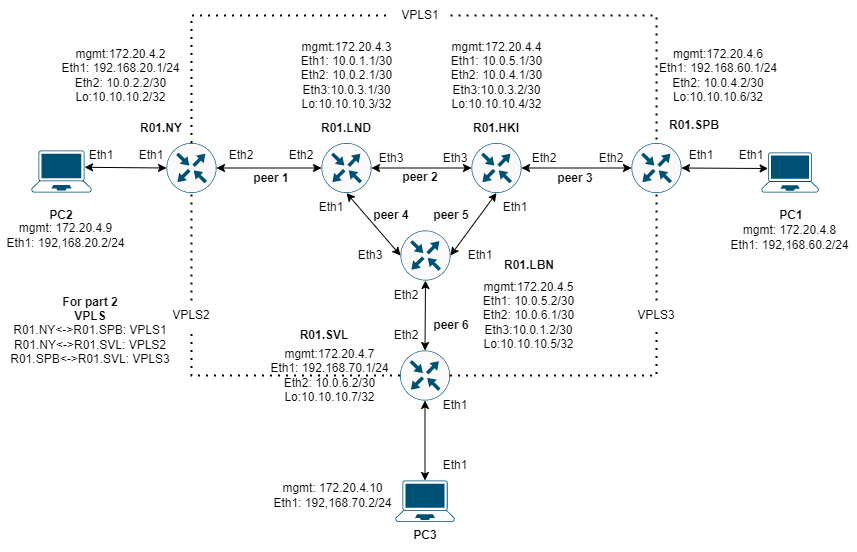
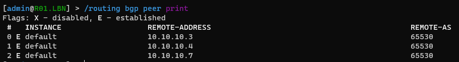
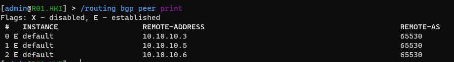
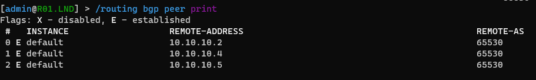
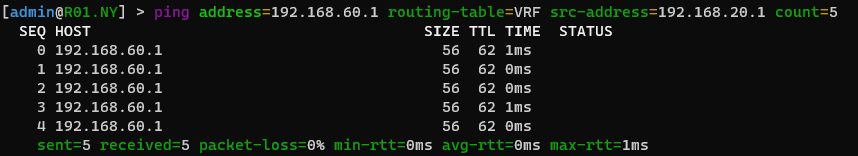
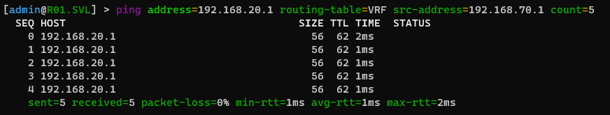
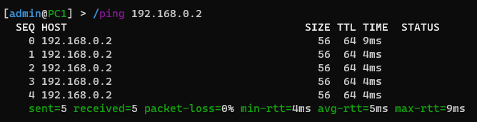
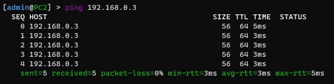
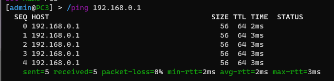

# Lab 4

University: [ITMO University](https://itmo.ru/ru/)

Faculty: [FICT](https://fict.itmo.ru/)

Course: [Introduction in routing](https://github.com/itmo-ict-faculty/introduction-in-routing)

Year: 2022/2023

Group: K33202

Author: Sorokin N. A.

Lab: Lab4

Date of create: 10.12.2022

Date of finished: 13.01.2023

---
# Топология

Топология использованная для реализации лабораторной работы представлена в файле topology.yml, а так же на схеме ниже.


---

# Запуск контейнеров

Разворачивание лабораторной работы производится с помощью команды `clab deploy —topo topology.yml`

Для перезапуска лабораторной работы со сбросом всех внутренних настроек используется флаг запуска `—reconfigure`

# Конфигурация устройств

Ниже будут перечислены конфигурации и обозначения команд для настройки сетевого оборудования.

# Базовая настройка маршрутизаторов

Для корректного выполнения лабораторной работы требуется настроить ip-адоеса, OSPF и MPLS на всех роутерах в соответствии со схемой топологии. Настройка OSPF и MPLS аналогична прошлой лабораторной работе.

# Настройка внешних маршрутизаторов

Настроки трех внешних маршрутизаторов аналогичны, поэтому команды будут представлены на примере одного маршрутизатора R01.NY.

## R01.NY

Для начала теебуется настроить iBGP с помощью следующих команд:

```
routing bgp instance set 0 client-to-client-reflection=no router-id=10.10.10.2
```
`router-id` - ip-адрес loopback интерфейса

```
routing bgp network add network=10.0.0.0/16
```

```
routing bgp peer add address-families=ip,l2vpn,l2vpn-cisco,vpnv4 name=BGP_peer1 remote-address=10.10.10.3 remote-as=65530 update-source=loopback
```

`name` - название пира, указанного на схеме топологии
`remote-address` - ip-адрес loopback интефрейса <u>соседствующего</u> маршрутизатора из схемы топологии
> Важно указывать `update-source=loopback` коректной работы iBGP

Далее для всех внешних роутеров для **первой части** лабораторной работы требуется настроить VRF с помощью следующих команд:

```
ip route vrf add export-route-targets=65530:444 import-route-targets=65530:444 interfaces=ether2 route-distinguisher=65530:444 routing-mark=VRF
```

`routing-mark` - метка таблицы маршрутизации

> Выбираем в качестве интерфейса для VRF - интерфейс, подключающий внешние хосты

```
routing bgp instance vrf add redistribute-connected=yes routing-mark=VRF
```

### Полная конфигурация R01.NY

```
/interface bridge
add name=loopback
/interface wireless security-profiles
set [ find default=yes ] supplicant-identity=MikroTik
/routing bgp instance
set default router-id=10.10.10.2
/routing ospf instance
set [ find default=yes ] router-id=10.10.10.2
/ip address
add address=172.31.255.30/30 interface=ether1 network=172.31.255.28
add address=10.0.2.2/30 interface=ether3 network=10.0.2.0
add address=10.10.10.2 interface=loopback network=10.10.10.2
add address=192.168.20.1/24 interface=ether2 network=192.168.20.0
/ip dhcp-client
add disabled=no interface=ether1
/ip route vrf
add export-route-targets=65530:444 import-route-targets=65530:444 interfaces=ether2 \\
    route-distinguisher=65530:444 routing-mark=VRF
/mpls ldp
set enabled=yes transport-address=10.10.10.2
/mpls ldp interface
add interface=ether3
add interface=ether2
/routing bgp instance vrf
add redistribute-connected=yes routing-mark=VRF
/routing bgp network
add network=10.0.0.0/16
/routing bgp peer
add address-families=ip,l2vpn,l2vpn-cisco,vpnv4 name=BGP_peer1 remote-address=10.10.10.3 remote-as=\\
    65530 update-source=loopback
/routing ospf network
add area=backbone
/system identity
set name=R01.NY
```

## R01.SPB

### Полная конфигурация R01.SPB

```
/interface bridge
add name=loopback
/interface wireless security-profiles
set [ find default=yes ] supplicant-identity=MikroTik
/routing bgp instance
set default router-id=10.10.10.6
/routing ospf instance
set [ find default=yes ] router-id=10.10.10.6
/ip address
add address=172.31.255.30/30 interface=ether1 network=172.31.255.28
add address=10.0.4.2/30 interface=ether3 network=10.0.4.0
add address=10.10.10.6 interface=loopback network=10.10.10.6
add address=192.168.60.1/24 interface=ether2 network=192.168.60.0
/ip dhcp-client
add disabled=no interface=ether1
/ip route vrf
add export-route-targets=65530:444 import-route-targets=65530:444 interfaces=ether2 \\
    route-distinguisher=65530:444 routing-mark=VRF
/mpls ldp
set enabled=yes transport-address=10.10.10.6
/mpls ldp interface
add interface=ether3
add interface=ether2
/routing bgp instance vrf
add redistribute-connected=yes routing-mark=VRF
/routing bgp network
add network=10.0.0.0/16
/routing bgp peer
add address-families=ip,l2vpn,l2vpn-cisco,vpnv4 name=BGP_peer3 remote-address=10.10.10.4 remote-as=\\
    65530 update-source=loopback
/routing ospf network
add area=backbone
/system identity
set name=R01.SPB
```

## R01.SVL

### Полная конфигурация R01.SVL
```
/interface bridge
add name=loopback
/interface wireless security-profiles
set [ find default=yes ] supplicant-identity=MikroTik
/routing bgp instance
set default router-id=10.10.10.7
/routing ospf instance
set [ find default=yes ] router-id=10.10.10.7
/ip address
add address=172.31.255.30/30 interface=ether1 network=172.31.255.28
add address=10.0.6.2/30 interface=ether3 network=10.0.6.0
add address=10.10.10.7 interface=loopback network=10.10.10.7
add address=192.168.70.1/24 interface=ether2 network=192.168.70.0
/ip dhcp-client
add disabled=no interface=ether1
/ip route vrf
add export-route-targets=65530:444 import-route-targets=65530:444 interfaces=ether2 \\
    route-distinguisher=65530:444 routing-mark=VRF
/mpls ldp
set enabled=yes transport-address=10.10.10.7
/mpls ldp interface
add interface=ether3
add interface=ether2
/routing bgp instance vrf
add redistribute-connected=yes routing-mark=VRF
/routing bgp network
add network=10.0.0.0/16
/routing bgp peer
add address-families=ip,l2vpn,l2vpn-cisco,vpnv4 name=BGP_peer6 remote-address=10.10.10.5 remote-as=\\
    65530 update-source=loopback
/routing ospf network
add area=backbone
/system identity
set name=R01.SVL
```

---
# Настройка внутренних маршрутизаторов

Настройки внутренних маршрутизаторов несколько отличаются от внеших. Требуется
при настройке iBPG включить Route Reflect.
## R01.LND
Как было сказано выше, настраиваем iBGP RR следующей командой:

```
routing bgp peer add address-families=ip,l2vpn,l2vpn-cisco,vpnv4 name=BGP_peer2 remote-address=10.10.10.4 remote-as=65000 route-reflect=yes update-source=loopback
```

> Требуется добавлять столько пиров, сколько **внутренних** соединений у маршрутизатора, причем `router-reflect` включается только **внутри** 'круга'

### Полная конфигурация R01.LND

```
/interface bridge
add name=loopback
/interface wireless security-profiles
set [ find default=yes ] supplicant-identity=MikroTik
/routing bgp instance
set default router-id=10.10.10.3
/routing ospf instance
set [ find default=yes ] router-id=10.10.10.3
/ip address
add address=172.31.255.30/30 interface=ether1 network=172.31.255.28
add address=10.0.1.1/30 interface=ether2 network=10.0.1.0
add address=10.0.2.1/30 interface=ether3 network=10.0.2.0
add address=10.0.3.1/30 interface=ether4 network=10.0.3.0
add address=10.10.10.3 interface=loopback network=10.10.10.3
/ip dhcp-client
add disabled=no interface=ether1
/mpls ldp
set enabled=yes transport-address=10.10.10.3
/mpls ldp interface
add interface=ether2
add interface=ether3
add interface=ether4
/routing bgp network
add network=10.0.0.0/16
/routing bgp peer
add address-families=ip,l2vpn,l2vpn-cisco,vpnv4 name=BGP_peer1 remote-address=10.10.10.2 remote-as=\\
    65530 update-source=loopback
add address-families=ip,l2vpn,l2vpn-cisco,vpnv4 name=BGP_peer2 remote-address=10.10.10.4 remote-as=\\
    65530 route-reflect=yes update-source=loopback
add address-families=ip,l2vpn,l2vpn-cisco,vpnv4 name=BGP_peer4 remote-address=10.10.10.5 remote-as=\\
    65530 route-reflect=yes update-source=loopback
/routing ospf network
add area=backbone
/system identity
set name=R01.LND
```

## R01.HKI

### Полная конфигурация R01.HKI

```
/interface bridge
add name=loopback
/interface wireless security-profiles
set [ find default=yes ] supplicant-identity=MikroTik
/routing bgp instance
set default router-id=10.10.10.4
/routing ospf instance
set [ find default=yes ] router-id=10.10.10.4
/ip address
add address=172.31.255.30/30 interface=ether1 network=172.31.255.28
add address=10.0.5.1/30 interface=ether2 network=10.0.5.0
add address=10.0.4.1/30 interface=ether3 network=10.0.4.0
add address=10.0.3.2/30 interface=ether4 network=10.0.3.0
add address=10.10.10.4 interface=loopback network=10.10.10.4
/ip dhcp-client
add disabled=no interface=ether1
/mpls ldp
set enabled=yes transport-address=10.10.10.4
/mpls ldp interface
add interface=ether2
add interface=ether3
add interface=ether4
/routing bgp network
add network=10.0.0.0/16
/routing bgp peer
add address-families=ip,l2vpn,l2vpn-cisco,vpnv4 name=BGP_peer2 remote-address=10.10.10.3 remote-as=\\
    65530 route-reflect=yes update-source=loopback
add address-families=ip,l2vpn,l2vpn-cisco,vpnv4 name=BGP_peer5 remote-address=10.10.10.5 remote-as=\\
    65530 route-reflect=yes update-source=loopback
add address-families=ip,l2vpn,l2vpn-cisco,vpnv4 name=BGP_peer3 remote-address=10.10.10.6 remote-as=\\
    65530 update-source=loopback
/routing ospf network
add area=backbone
/system identity
set name=R01.HKI
```

## R01.LBN

### Полная конфигурация R01.LBN

```
/interface bridge
add name=loopback
/interface wireless security-profiles
set [ find default=yes ] supplicant-identity=MikroTik
/routing bgp instance
set default router-id=10.10.10.5
/routing ospf instance
set [ find default=yes ] router-id=10.10.10.5
/ip address
add address=172.31.255.30/30 interface=ether1 network=172.31.255.28
add address=10.0.5.2/30 interface=ether2 network=10.0.5.0
add address=10.0.6.1/30 interface=ether3 network=10.0.6.0
add address=10.0.1.2/30 interface=ether4 network=10.0.1.0
add address=10.10.10.5 interface=loopback network=10.10.10.5
/ip dhcp-client
add disabled=no interface=ether1
/mpls ldp
set enabled=yes transport-address=10.10.10.5
/mpls ldp interface
add interface=ether2
add interface=ether3
add interface=ether4
/routing bgp network
add network=10.0.0.0/16
/routing bgp peer
add address-families=ip,l2vpn,l2vpn-cisco,vpnv4 name=BGP_peer4 remote-address=10.10.10.3 remote-as=\\
    65530 route-reflect=yes update-source=loopback
add address-families=ip,l2vpn,l2vpn-cisco,vpnv4 name=BGP_peer5 remote-address=10.10.10.4 remote-as=\\
    65530 route-reflect=yes update-source=loopback
add address-families=ip,l2vpn,l2vpn-cisco,vpnv4 name=BGP_peer6 remote-address=10.10.10.7 remote-as=\\
    65530 update-source=loopback
/routing ospf network
add area=backbone
/system identity
set name=R01.LBN
```

# Настройка внешних хостов

## PC1

### Полная конфигурация PC1

```
/interface wireless security-profiles
set [ find default=yes ] supplicant-identity=MikroTik
/ip address
add address=172.31.255.30/30 interface=ether1 network=172.31.255.28
add address=192.168.60.2/24 interface=ether2 network=192.168.60.0
/ip dhcp-client
add disabled=no interface=ether1
/system identity
set name=PC1/interface wireless security-profiles
set [ find default=yes ] supplicant-identity=MikroTik
/ip address
add address=172.31.255.30/30 interface=ether1 network=172.31.255.28
add address=192.168.20.2/24 interface=ether2 network=192.168.20.0
/ip dhcp-client
add disabled=no interface=ether1
/system identity
set name=PC2
```

## PC2

### Полная конфигурация PC2

```
/interface wireless security-profiles
set [ find default=yes ] supplicant-identity=MikroTik
/ip address
add address=172.31.255.30/30 interface=ether1 network=172.31.255.28
add address=192.168.4.7 interface=ether2 network=192.168.4.0
/ip dhcp-client
add disabled=no interface=ether1
/system identity
set name=PC2
```

### PC3

### Полная конфигурация PC3

```
/interface wireless security-profiles
set [ find default=yes ] supplicant-identity=MikroTik
/ip address
add address=172.31.255.30/30 interface=ether1 network=172.31.255.28
add address=192.168.70.2/24 interface=ether2 network=192.168.70.0
/ip dhcp-client
add disabled=no interface=ether1
/system identity
set name=PC3
```

# Проверка настроек сети I

## Проверка VRF

```
routing bgp peer print
```







```
ping address=192.168.60.1 routing-table=VRF src-address=192.168.20.1 count=5
```





---

# Часть 2

Для выполнения второй части лабораторной работы - настройки VPLS, потребуется отключить созданный ранее VRF на трех внеших маршрутизаторах с помощью следующих команд:

```
ip route vrf set 0 disabled=yes
```

```
routing bgp instance vrf set 0 disabled=yes
```

## R01.NY

После отключения VRF можно настроить VPLS  с помощью следующих команд:

```
interface bridge add name=VPLS_bridge
```

```
interface vpls add disabled=no name=VPLS1 remote-peer=10.10.10.6 vpls-id=4:0
```
`name` - название VPLS соединения из схемы топологии
`remote-peer` - ip-адрес loopback интерфейса внешего соседнего маршрутизатора из схемы топологии

```
interface bridge port add bridge=VPLS_bridge interface=ether2
interface bridge port add bridge=VPLS_bridge interface=VPLS1
interface bridge port add bridge=VPLS_bridge interface=VPLS2
```

### Полная конфигурация R01.NY

```
/interface bridge
add name=VPLS_bridge
add name=loopback
/interface vpls
add disabled=no l2mtu=1500 mac-address=02:CD:71:C4:B7:28 name=VPLS1 remote-peer=10.10.10.6 vpls-id=\\
    4:0
add disabled=no l2mtu=1500 mac-address=02:82:62:49:AA:D0 name=VPLS2 remote-peer=10.10.10.7 vpls-id=\\
    4:0
/interface wireless security-profiles
set [ find default=yes ] supplicant-identity=MikroTik
/routing bgp instance
set default router-id=10.10.10.2
/routing ospf instance
set [ find default=yes ] router-id=10.10.10.2
/interface bridge port
add bridge=VPLS_bridge interface=ether2
add bridge=VPLS_bridge interface=VPLS1
add bridge=VPLS_bridge interface=VPLS2
/ip address
add address=172.31.255.30/30 interface=ether1 network=172.31.255.28
add address=10.0.2.2/30 interface=ether3 network=10.0.2.0
add address=10.10.10.2 interface=loopback network=10.10.10.2
add address=192.168.20.1/24 interface=ether2 network=192.168.20.0
/ip dhcp-client
add disabled=no interface=ether1
/ip route vrf
add disabled=yes export-route-targets=65530:444 import-route-targets=65530:444 interfaces=ether2 \\
    route-distinguisher=65530:444 routing-mark=VRF
/mpls ldp
set enabled=yes transport-address=10.10.10.2
/mpls ldp interface
add interface=ether3
add interface=ether2
/routing bgp instance vrf
add disabled=yes redistribute-connected=yes routing-mark=VRF
/routing bgp network
add network=10.0.0.0/16
/routing bgp peer
add address-families=ip,l2vpn,l2vpn-cisco,vpnv4 name=BGP_peer1 remote-address=10.10.10.3 remote-as=\\
    65530 update-source=loopback
/routing ospf network
add area=backbone
/system identity
set name=R01.NY
```

## R01.SPB

### Полная конфигурация R01.SPB

```
/interface bridge
add name=VPLS_bridge
add name=loopback
/interface vpls
add disabled=no l2mtu=1500 mac-address=02:A8:37:2A:F7:7F name=VLPS1 remote-peer=10.10.10.2 vpls-id=\\
    4:0
add disabled=no l2mtu=1500 mac-address=02:78:BB:2E:AF:E5 name=VLPS3 remote-peer=10.10.10.7 vpls-id=\\
    4:0
/interface wireless security-profiles
set [ find default=yes ] supplicant-identity=MikroTik
/routing bgp instance
set default router-id=10.10.10.6
/routing ospf instance
set [ find default=yes ] router-id=10.10.10.6
/interface bridge port
add bridge=VPLS_bridge interface=ether2
add bridge=VPLS_bridge interface=VLPS1
add bridge=VPLS_bridge interface=VLPS3
/ip address
add address=172.31.255.30/30 interface=ether1 network=172.31.255.28
add address=10.0.4.2/30 interface=ether3 network=10.0.4.0
add address=10.10.10.6 interface=loopback network=10.10.10.6
add address=192.168.60.1/24 interface=ether2 network=192.168.60.0
/ip dhcp-client
add disabled=no interface=ether1
/ip route vrf
add disabled=yes export-route-targets=65530:444 import-route-targets=65530:444 interfaces=ether2 \\
    route-distinguisher=65530:444 routing-mark=VRF
/mpls ldp
set enabled=yes transport-address=10.10.10.6
/mpls ldp interface
add interface=ether3
add interface=ether2
/routing bgp instance vrf
add disabled=yes redistribute-connected=yes routing-mark=VRF
/routing bgp network
add network=10.0.0.0/16
/routing bgp peer
add address-families=ip,l2vpn,l2vpn-cisco,vpnv4 name=BGP_peer3 remote-address=10.10.10.4 remote-as=\\
    65530 update-source=loopback
/routing ospf network
add area=backbone
/system identity
set name=R01.SPB
```

## R01.SVL

### Полная конфигурация R01.SVL

```
/interface bridge
add name=VPLS_bridge
add name=loopback
/interface vpls
add disabled=no l2mtu=1500 mac-address=02:EE:9D:DA:16:5A name=VPLS2 remote-peer=10.10.10.2 vpls-id=\\
    4:0
add disabled=no l2mtu=1500 mac-address=02:14:19:37:2E:59 name=VPLS3 remote-peer=10.10.10.6 vpls-id=\\
    4:0
/interface wireless security-profiles
set [ find default=yes ] supplicant-identity=MikroTik
/routing bgp instance
set default router-id=10.10.10.7
/routing ospf instance
set [ find default=yes ] router-id=10.10.10.7
/interface bridge port
add bridge=VPLS_bridge interface=ether2
add bridge=VPLS_bridge interface=VPLS2
add bridge=VPLS_bridge interface=VPLS3
/ip address
add address=172.31.255.30/30 interface=ether1 network=172.31.255.28
add address=10.0.6.2/30 interface=ether3 network=10.0.6.0
add address=10.10.10.7 interface=loopback network=10.10.10.7
add address=192.168.70.1/24 interface=ether2 network=192.168.70.0
/ip dhcp-client
add disabled=no interface=ether1
/ip route vrf
add disabled=yes export-route-targets=65530:444 import-route-targets=65530:444 interfaces=ether2 \\
    route-distinguisher=65530:444 routing-mark=VRF
/mpls ldp
set enabled=yes transport-address=10.10.10.7
/mpls ldp interface
add interface=ether3
add interface=ether2
/routing bgp instance vrf
add disabled=yes redistribute-connected=yes routing-mark=VRF
/routing bgp network
add network=10.0.0.0/16
/routing bgp peer
add address-families=ip,l2vpn,l2vpn-cisco,vpnv4 name=BGP_peer6 remote-address=10.10.10.5 remote-as=\\
    65530 update-source=loopback
/routing ospf network
add area=backbone
/system identity
set name=R01.SVL
```

## PC1

### Полная конфигурация PC1

```
/interface wireless security-profiles
set [ find default=yes ] supplicant-identity=MikroTik
/ip address
add address=172.31.255.30/30 interface=ether1 network=172.31.255.28
add address=192.168.0.1/24 interface=ether2 network=192.168.0.0
/ip dhcp-client
add disabled=no interface=ether1
/system identity
set name=PC1
```

## PC2

### Полная конфигурация PC2

```
/interface wireless security-profiles
set [ find default=yes ] supplicant-identity=MikroTik
/ip address
add address=172.31.255.30/30 interface=ether1 network=172.31.255.28
add address=192.168.0.2/24 interface=ether2 network=192.168.0.0
/ip dhcp-client
add disabled=no interface=ether1
/system identity
set name=PC2
```

## PC3

### Полная конфигурация PC3

```
/interface wireless security-profiles
set [ find default=yes ] supplicant-identity=MikroTik
/ip address
add address=172.31.255.30/30 interface=ether1 network=172.31.255.28
add address=192.168.0.3/24 interface=ether2 network=192.168.0.0
/ip dhcp-client
add disabled=no interface=ether1
/system identity
set name=PC3
```

# Проверка настроек сети II

## Проверка VPLS






